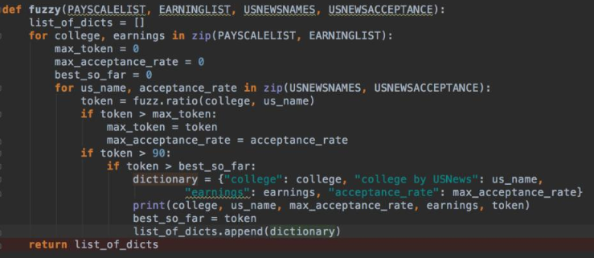

I wanted to create a simple chart that will help folks like my-few-years-younger-self make good college decisions. Specifically, I wanted to present data that will help teenagers understand whether the industry-wide benchmark, low acceptance rate, really is the right statistic to take into consideration when considering alternatives.

<b>Data:</b>
In order to diagnose correlation between acceptance rates, and expected income I had to get this data. Ideally, I was looking for a table with those columns, but of course it was harder than expected. So where could I get data from? 

<b>Scraping:</b>
I found a reliable source (Payscale) that presents expected income for recent graduates from many colleges. With the help of friends from StackOverflow I learned how to scrape CSS and got the data. I was able to get my hands on reliable acceptance rates (USNews) as well, and so I was ready to go and manipulate the data as much as I wanted. Or at least that's  what I thought...

<b>Fuzzy Names:</b>
Apparently, sometimes there are many names for the same institution. New York University, could be NYU, New-York University, "New-York University, New-York, NY",  written with CAPS or lowercase.  What a mess...

<b>The Core:</b>
The core of this project is where I match between very similar names of the same college, to create a tokenized database that will include acceptance rates and potential earnings per college. With Python, I was able to use a package called FuzzyWuzzy, that exists exactly for this purpose.

<b>Back and Forth:</b>
I played with this package a bunch of times, but it seemed like the algo wasn't sophisticated enough. I had more matches than items (one list was longer, and it matched more than once with the other list). I've written the technical details of how I solved the problem here.

<b>Finally: </b>
In front of you is the data, as neat as a pin. The chart is interactive so feel free to hover over your preferred dot.

The trend is quite obvious -  selective schools tend to lead to a higher expected income.**
Here's for another fun project, and great college-picking for you guys. 

<!--   Tableau javascript API   -->

 
<b>Technical Details:

FuzzyWuzzy includes several versions of FuzzyMatch algos, all of which I tried.  With some trial and error, I ended up choosing a combination of fuzz.ratio  and a threshold score (90). The relevant snippet of code looks like this:

I know that one list contains only 280 items, while the other list was 960 items,  I knew that if I got a match for more than 280 items, then the sinceI started with fuzz.token_set_ratio - algo overfitted.  Starting with 556 matches I incrementally made progress.  After consideration of other algos that are based on phonetic similarity rather than graphic, I consulted a friend who suggested cleaning and tokenizing the data further before giving up on fuzzy. I ended up sticking to fuzzy and spending more time cleaning the data.

As always, all the code can be found on [GitHub.](https://github.com/oba2311/HigherEdu_Project)

----------
**The data, as in all projects is limited to publicly available sources. This research was done independently of any institution, it should not be taken as any sort of an official advice whatsoever. The author is not responsible for the accuracy of the data.